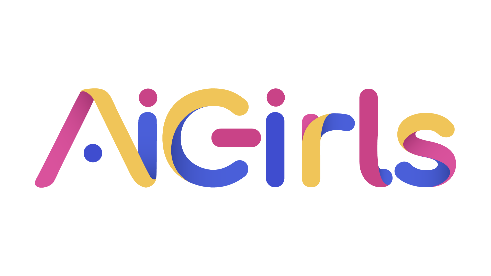

# dev-to-posts

Repositório com as postagens que estão no dev.to/aigirls

Se você tem vontade de escrever algum tutórial ou artigos em geral na área de Inteligência Artificial, mas não sabia onde colocar. Agora nós temos um local para isso! Se você quiser fazer parte desse espaço, sinta-se bem vinda :heard: 
No noss blog compartilhamos assuntos que envolvem inteligência artificial e ciência de dados, e nele você pode escrever:

* Sua opinião sobre alguma coisa, por exemplo: "A importância da lei LGPD" ou escrever sobre os viés que temos na área de IA, como por exemplo: "Por que os chatbots tem vozes femininas?"
* Artigos técnicos ou introdutórios, por exemplo o nosso sobre [Machine learning](https://dev.to/aigirlsbr/afinal-o-que-e-machine-learning-ih5)
* Carreiras
* Contar sua experiência e aprendizados
* Entre outros

## Temos um template

Para te ajudar na hora da escrita, nós temos um template. Ele também nos ajuda a manter um padrão nas postagens, como por exemplo, ter sempre o nome da autora no final junto com as nossas redes sociais.

Para saber mais como é esse template, acesse o [arquivo](posts/template.md). 

## Como submeter um post para nós?

Antes de submter o seu artigo você irá precisa criar um documento dentro da pasta [Posts](posts) com o seguinte formato:

Nome_do_Artigo.md

Não esqueça de olhar os posts antigos no blog e no repositório, para que você tenhamos artigos repetidos!! :smile:

## Aceitamos contribuição

Se você quiser contribuir para melhorar esse repositório, estamos abertas para receber Pull Request com melhorias :smile:
