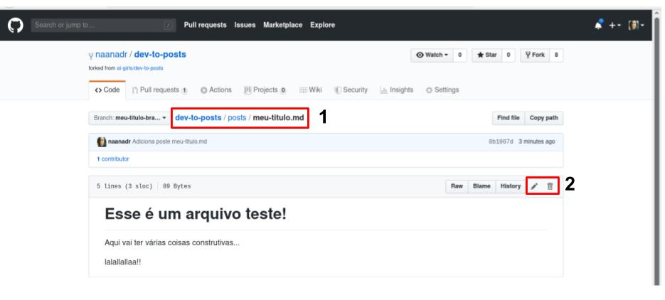
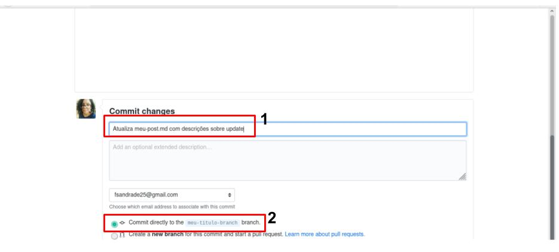

# Editar Arquivo

Acesse o arquivo que você deseja alterar (**item em destaque 1**) e selecione a opção que melhor te convêm (**item em destaque 2**).

Após selecionar qualquer uma dessas ações, você será redirecionada para uma nova janela que poderá ser de edição de arquivo (veja o tutorial de [escrevendo post](tutorial/escrevendo-post.md)) ou de confirmação de remover do arquivo. Independente da opção selecionada, você verá no campo inferior da página uma seção de commit (veja [boas práticas de um commit](boas-praticas-commit.md)). Informe a mensagme do commit (**item em destaque 1**), a branch que ele irá (**item em destaque 2**) e confirme o commit.

