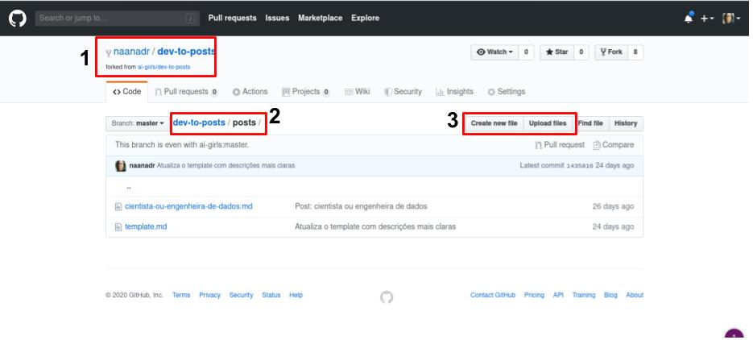
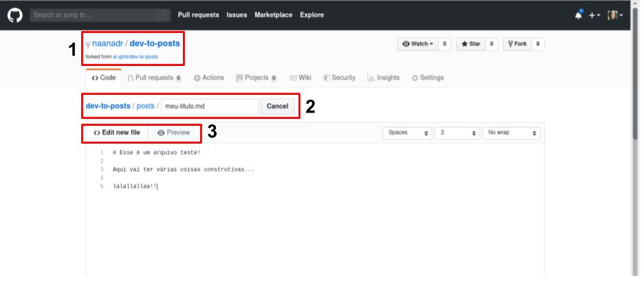
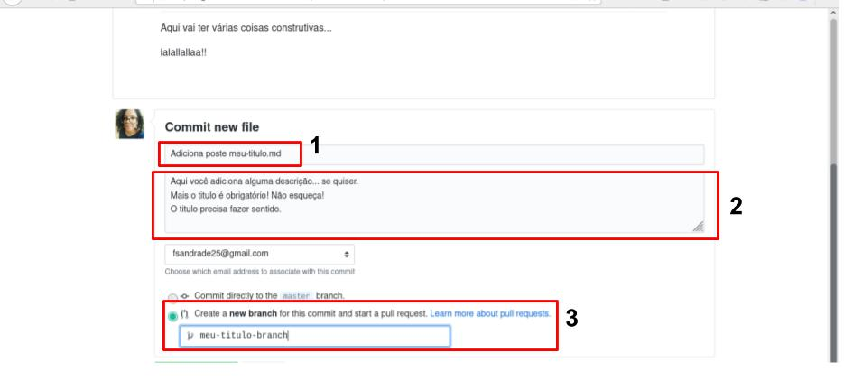
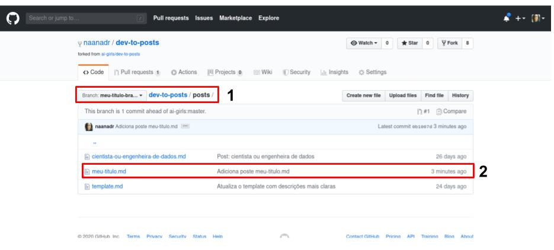

# Escrevendo Post

Você pode escrever seu post em alguns editores online ([StackEdit](https://stackedit.io/app#), [DILLINGER](https://dillinger.io/)...) ou você pode utilizar o próprio GitHub. 

## Criando o arquivo

Antes de escrever o seu post, você vai precisar criar o arquivo. Para criar esse arquivo (isso serve para qualquer arquivo), vá para a pasta onde o arquivo ficará armazenado (**item em destaque 2**) e clique em `Create new file` (**item em destaque 3**).

## Editando o arquivo

O GitHUb te levará para uma nova página (após a etapa anterior), onde você fornecerá o nome do arquivo (**item em destaque 2**) e não se esqueça de colocar `.md` como a extensão dele. Você pode mudar do editor de texto, para o preview do seu arquivo no **item em destaque 3**. 

> Se você quiser criar uma pasta para inserir o arquivo, você pode fazer agora nesse momento. No campo `nome` (**item em destaque 2**), insira: `nome-da-sua-pasta/nome-do-arquivo.md`

## Enviando o arquivo

Quando você terminar de escrever seu post, será a hora de fazer o commit dele (veja [boas praticas de um commit](boas-praticas-commit.md)). Para isso, no canto inferior da página você encontrará uma seção. Nela você deverá passar um titulo (**item em destaque 1**), uma descrição (**item em destaque 2**) que é opcional e por fim, você deverá selecionar a branch que o seu commit irá (**item em destaque 3**).

> Lembre-se, a branch que você criará deverá ser utilizada durante todo o processo. 

Pronto, seu arquivo foi criado! 

## Editando/removendo o arquivo, após o seu envio.

Veja o Tutorial de [Edição/Remoção de arquivo](editar-arquivo.md)
