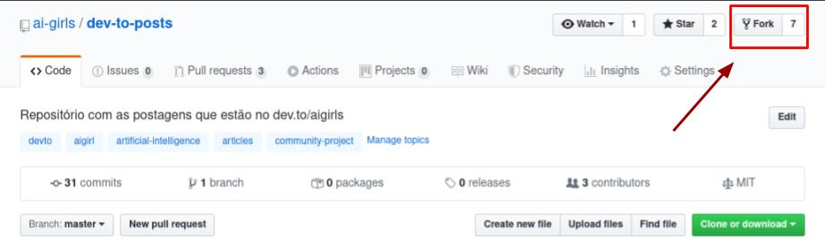
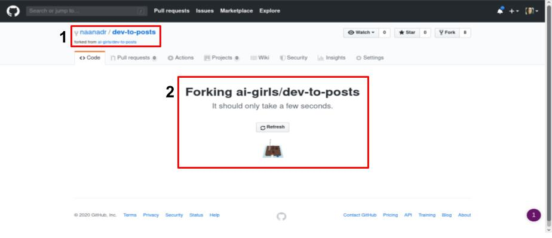
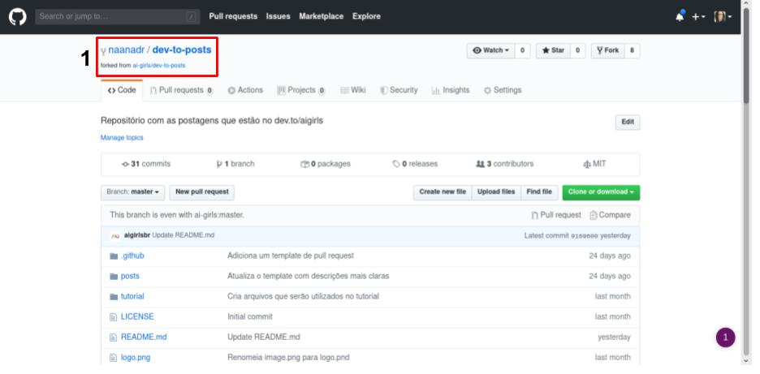

# Fork 

## O que é um Fork?

**Fork** é como nós chamamos a ação de "copiar" um repositório para dentro da sua conta. *Como assim?* Quando você forka um repositório no GitHub, será criado um repositório na sua conta com o mesmo nome e os mesmos conteúdos do repositório que foi forkado. 

Para saber mais veja esse [link](https://help.github.com/en/github/collaborating-with-issues-and-pull-requests/about-forks) do proprío GitHub.

## Como fazer um fork?

> Vamos lá! O que eu vou explicar aqui, serve para qualquer repositório que esteja no Github

Para forkar um repositório, vamos cliar nesse botão **Fork** em destaque na imagem:

O Github irá fazer todo o trabalho sujo de copiar o projeto para a nossa conta pessoa... e enquanto isso, ele vai mostrar a telinha a seguir. Se você reparar no **item em destaque 1**, o projeto está sendo copiado para o perfil `naanadr` com o nome `dev-to-posts`, que no fim fica `naanadr/dev-to-posts`.

YUPI!!! O projeto foi forkado!! 

Agora você tem uma copia do repositório `dev-to-posts` em seu Github (**item em destaque 1**). 

**Uma observação!** Quando o repositorio `ai-girls/dev-to-posts` receber uma alteração, o seu repositório `seu-nome/dev-to-posts` não será alterado. Eles agora são repositórios paralelos. Para saber como passar suas alterações para o projeto principal, veja o [tutorial de Pull Request](pull-request.md)
