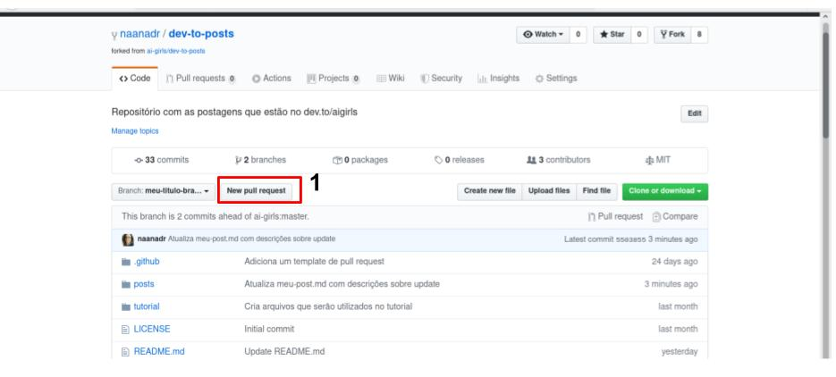
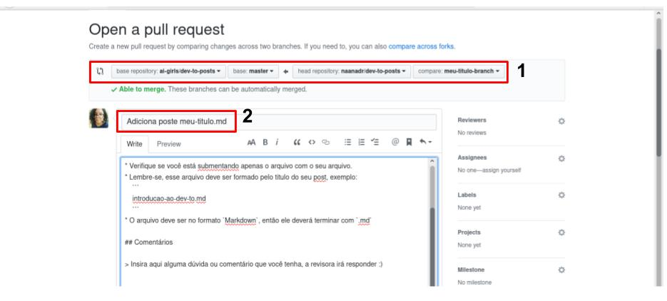
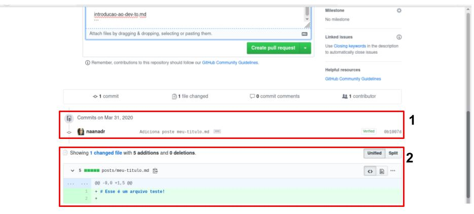
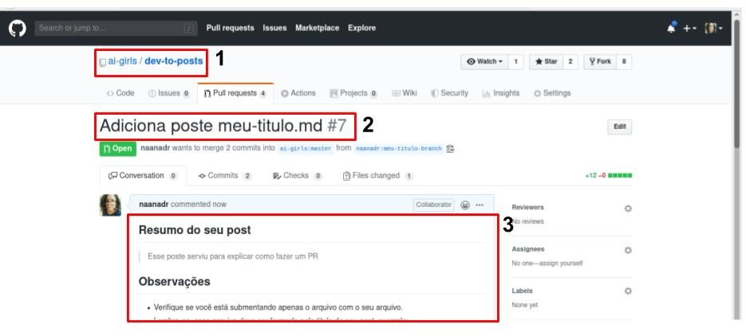

# Pull Request

Após você ter terminado de escrever o seu post e tudo está ok, está na hora de criar um Pull Request. Que consiste de enviar as alterações que você realizou no projeto, em uma determinada branch, para uma outra branch. Que nesse caso, será da sua branch para a branch `master` do `ai-girls/dev-to-posts`. Para saber mais, veja a [documentação do github sobre pull request](https://help.github.com/pt/github/collaborating-with-issues-and-pull-requests/creating-a-pull-request-from-a-fork).

> Você também pode fazer um pull request de uma branch sua (uma branch chamada `dev`) para uma outra branch em seu projeto (como a branch `master`). 

Para criar um Pull Request no GitHub, você precisará se certificar em qual branch você está (nesse exemplo, eu estou na branch `meu-titulo-branch` e por fim clicar em `New Pull Request` (**item em destaque 1**). Lembrando, que você pode ter mais de um pull request, porém, é esperado que cada um tenha um objetivo expecifico e cumpra o que se está propondo (no nosso caso, submeter um post para o nosso blog). 

Você será redirecionada para a página de criação do pull request, nela você irá informar a branch de destino e a branch de origem (**item em destaque 1**). Além disso, também será necessário informar um titulo do pull request (**item em destaque2**), que deverá informar o que ele está fazendo, por exemplo, "Adiciona post Titulo do Post". Logo em seguida, você verá a descrição do pull request, ela já estará preenchida, leia o que está escrito nela e altere apenas o campo do `resumo` e o campo de `comentários`.

Se você quiser ver o que está sendo enviado em seu pull request, você pode ver o log de commits relacionados a branch que você estava utilizando (**item em destaque 1**) e os arquivos que serão enviados, junto com as alterações que eles sofreram (**item em destaque 2**).

Seu pull request ficará parecido com esse aqui:

## Alterar conteúdo após o Pull Request

Se após o pull request ter sido aberto, você percebeu que precisa alterar algum arquivo ou submeter mais um. Não se estresse! Faça isso na sua branch, no projeto que você forkou e commite normalmente. O GitHub irá automaticamente perceber que teve uma atualização e irá atualizar o log do pull request.

## Sendo avaliada

O seu Pull Request será aprovado após a avaliação de uma revisadora. Ela poderá pedir para que você faça correções, ou explique alguma coisa. Lembre-se que são comentários construtivos. 

Caso você discorde de alguma coisa, ou queira discorrer sobre algum comentário, responda à revisora :smile: 

**E não esqueça de ficar acompanhando seu Pull Request!**.
