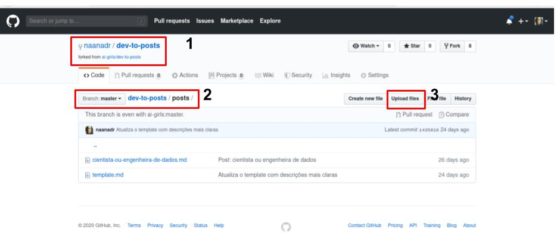
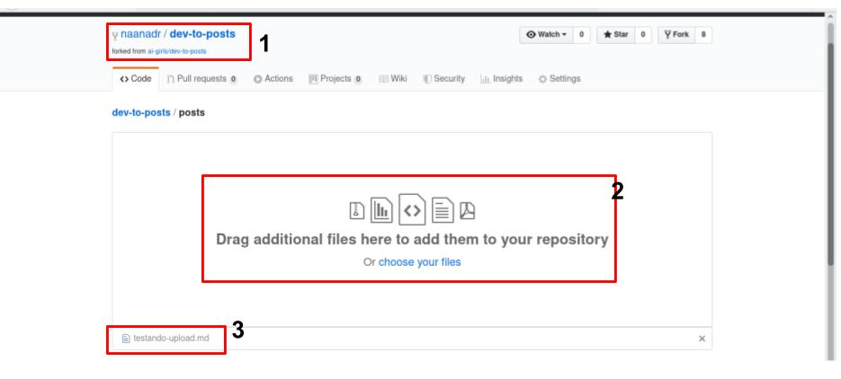
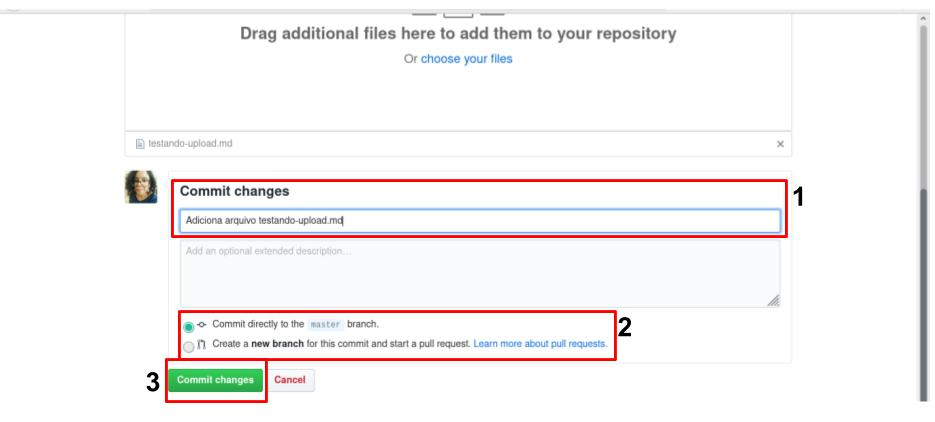

 # Upload de Arquivo
 
 Se você *escreveu seu post em um arquivo* e deseja subir ele para o repositório que você criou (aquele do [Fork](tutorial/fork.md)). Segue os próximos passos... mas se você desejar, você pode *escrever o seu post no editor do github*, veja o tutorial de [Editar Arquivo](tutorial/editar-arquivo.md) para mais informações.
 
 ## Como fazer upload de arquivo?
 
 Primeiro, precisamos nos certificar que estamos no projeto certo (**item em destaque 1**). Depois disso, vamos para o local que você deseja subir o arquivo, que nesse caso será dentro da pasta `dev-to-posts/posts` (**item em destaque 2**). Clique em `Upload files` (**item em destaque 3**) para fazer upload de um arquivo.
 
 
 
Após cliar no botão `Upload files` você será redirecionada para a página a seguir. Onde na região do meio (**item em destaque 2**) você clicará para selecionar um arquivo salvo localmente em sua máquina. Após o upload concluido, o arquivo aparecer no canto inferior esquerdo (**item em destaque 3**). 
 
 > Você pode fazer upload de mais de um arquivo, mas lembre-se das [boas práticas de um commit](tutoriais/boas-praticas-commit.md).
 

Continuando na mesma página, na parte inferior, nós encontraremos uma seção para realizar um *commit*. Nessa seção você deve inserir uma mensagem de commit (**item em destaque 1**), que não ultrapasse 50 caracteres (o github irá lhe avisar, se ultrapassar).

Nessa fase, você pode escolher se deseja realizar o commit na branch atual (a branch master) ou se deseja criar uma nova (**item em destaque 2**). E enfim, clique no botão verde para realizar o commit (**região em destaque 3**).

> Lembre-se das [boas práticas de um commit](tutoriais/boas-praticas-commit.md).

